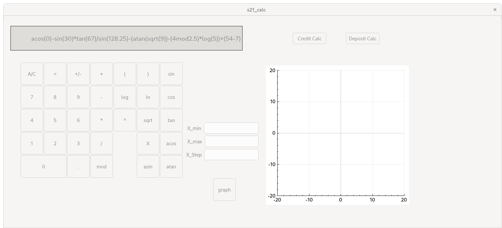
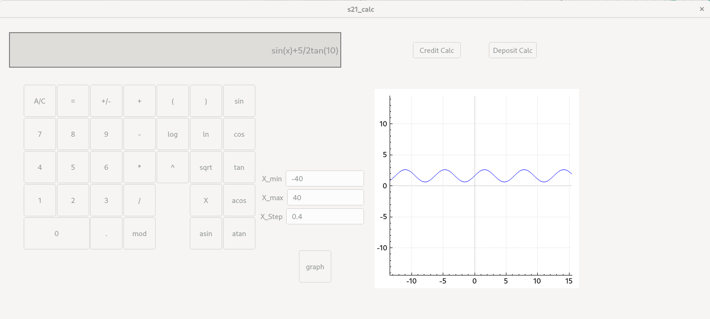

# smart_calc_on_C

Implementation of SmartCalc

## Introduction

In this project I implemented an extended version of the usual calculator, which can be found in the standard applications of each operating system in the C programming language. The calculator with the ability to calculate arithmetic expressions by following the order, as well as some mathematical functions (sine, cosine, logarithm, etc.). It also support the use of the _x_ variable and the graphing of the corresponding function.

## Usage/Examples

Smart Calc



Function graph



Credit Calc


## Install calc

```bash
  make install
```
    
## Run Locally

Clone the project

```bash
  git clone
```

Go to the project directory

```bash
  cd src/calc
```

Install 

```bash
  make install
```

```bash
  make exec
```

## Running Tests

To run tests, run the following command

```bash
  make tests
```

## Information

### Polish notation and reverse Polish notation

Despite the absolute convenience of working with the classical form of writing expressions, when it comes to writing programs, queries are most often formed in the format `what to do -> what data to perform operations with`. So, around 1920, the Polish logician Jan Lukasiewicz invented  prefix notation (later also called Polish notation or normal Polish notation) in order to simplify propositional logic.

Let's take a look at the ways to write expressions:

The expression written in conventional infix notation:

>2 / (3 + 2) * 5

The expression written in Polish prefix notation:

>\* (/ 2 (+ 3 2)) 5

Normally parentheses between operations of equal priority are unnecessary and the final expression looks like this:

>\* / 2 (+ 3 2) 5

The Polish notation is widely used in the field of computing, in particular it is used in many stack-oriented programming languages such as PostScript, and for a long time it was the basis for many calculating machines (calculators).

In the mid-1950s, the Australian philosopher and computer scientist Charles Hamblin developed reverse polish notation (RPN). Hamblin's work was presented at a conference in June 1957, and published in 1957 and 1962.

The first computers to support reverse Polish notation were the KDF9 from the English Electric Company, announced in 1960 and released in 1963, and the american Burroughs B5000, announced in 1961, released the same in 1963.

Friden used the RPN in desktop calculators and introduced the EC-130 in June 1964. In 1968, engineers at Hewlett-Packard developed the 9100A desktop calculator with RPN support. This calculator made reverse Polish notation popular among scientists and engineers, even though the early advertisements for the 9100A did not mention RPN. In 1972 the HP-35 with RPN support became the first scientific pocket calculator.

The RPN was used in the soviet engineering calculator B3-19M (a joint development with the GDR) produced in 1976. All programmable microcalculators produced in USSR up to the end of 1980s, except for "Electronica MK-85" and "Electronica MK-90", used RPN - it was easier to implement and allowed to use less number of commands during programming compared to conventional algebraic notation (program memory amount was always a critical resource in models of that time). RPN was used in russian programmable calculators "Electronica MK-152" and "Electronica MK-161", ensuring they were compatible with programs written for soviet calculators.

Reverse Polish notation had all the advantages of the progenitor because it removes the need for parentheses which allows to reduce the volume of expressions. This had led to a decrease in the number of commands, when writing computer programs. That is why sometimes Reverse Polish notation is called Reverse bracketless notation.

The expression written in Reverse Polish (bracketless) notation:

> 2 3 2 + / 5 *

### Dijkstra's algorithm

Edsger Dijkstra invented an algorithm for converting expressions (including functions) from infix to Reverse Polish notation. The algorithm was named the "shunting-yard algorithm", because its operation resembles that of a railroad shunting yard.

>Before we look at the algorithm itself, let's make a small remark and introduce the token. A token is the simplest unit of morphological parsing of an expression. So, the expression 2 / (3 + 2) * 5 (the blanks are added for easy perception and do not carry any semantic sense), broken down into tokens, will look like this [2], [/], [(], [3], [+], [2], [)], [*], [5], where [2, 3, 5] are numerical tokens, [/, (, +, ), *] - are tokens-operations.

The Shunting-yard algorithm is stack-based. There are two text variables involved in the conversion: the input and the output string. The conversion process uses the stack to store operations not yet added to the output string. The conversion program sequentially reads each token from the input string and on each step does some actions based on which tokens have been read.

#### Implementation of the algorithm

As long as there are unprocessed tokens in the input string, read the next token:

If the token is:
- A number – put it into the output queue

- A function or a left parenthesis – push it onto the stack

- A function arguments separator (e.g. comma):
    - Move operators from the stack to the output queue until the token at the top of the stack is a left parenthesis. If there is no left parenthesis in the stack, there is an error in the expression.

- Operator (O1):
    - While there is an token-operator O2 at the top of the stack, that has greater precedence than O1 or they have the same precedence and O1 is left-associative:
    - Pop O2 from the stack into the output queue
    - Push O1 onto the stack

- A right parenthesis:
    - While the token at the top of the stack is not a left parenthesis, pop the token-operators from the stack into the output queue.
    - Pop the left parenthesis from the stack and discard it.
    - If there is a function token at the top of the stack, then pop the function from the stack into the output queue
    - If the stack ended before the left parenthesis was read, there is an error in the expression.

If there are no more tokens left in the input string:
- As long as there are operators in the stack:
    - If there is a parenthesis at the top of the stack - there is an error in the expression.
    - Pop the operator from the stack onto the output queue

End.


